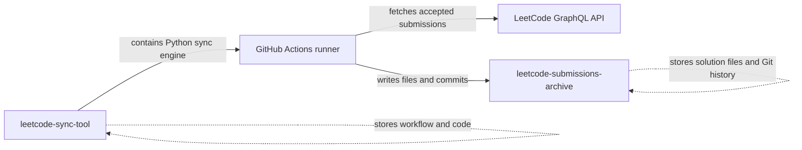
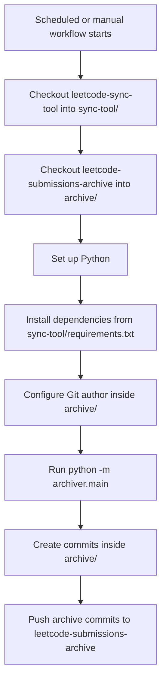
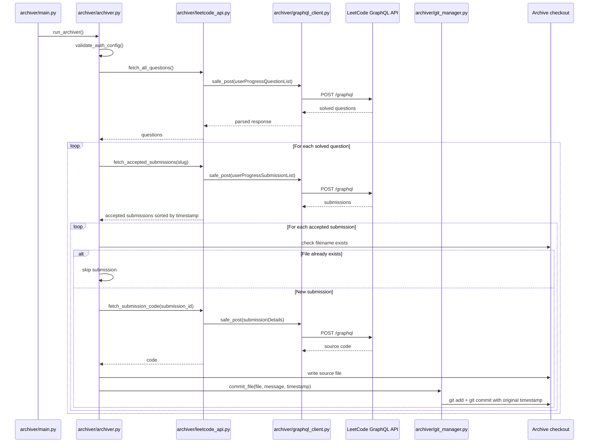
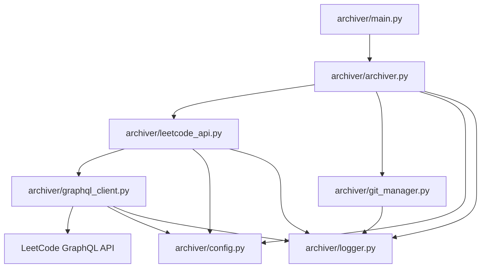
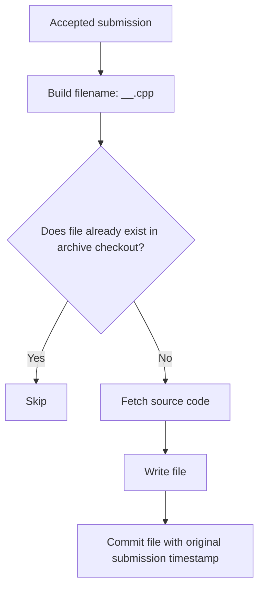
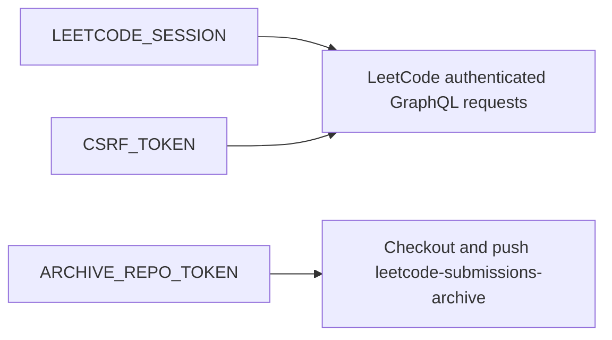
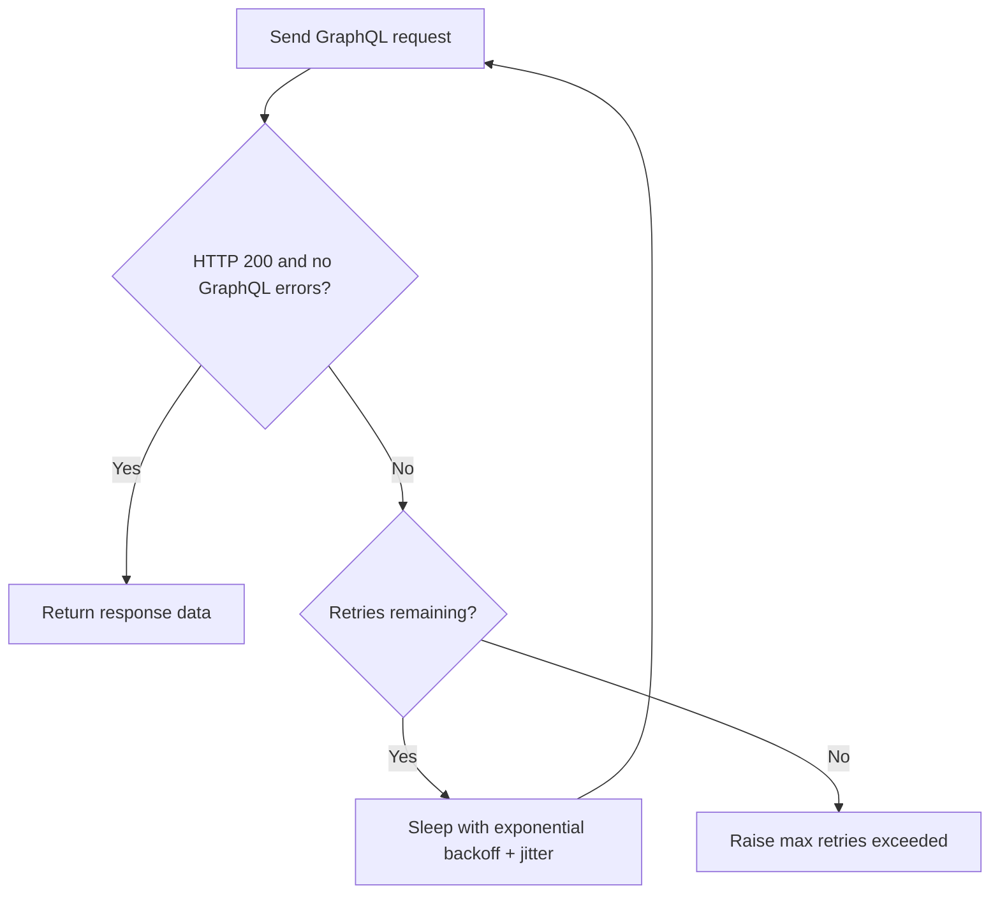

# Architecture

This document explains how `leetcode-sync-tool` works at a high level, how data moves through the system, and how the scheduled GitHub Actions workflow writes submissions into the archive repository.

## Repository Model

`leetcode-sync-tool` and `leetcode-submissions-archive` intentionally have separate responsibilities.



The sync-tool repository stores automation code. The archive repository stores the generated submission files and their timestamped commit history.

## Scheduled Workflow

The GitHub Actions workflow runs from `leetcode-sync-tool`, but the archive repository is checked out separately and used as the working directory for generated files.



The workflow sets `PYTHONPATH` to the sync-tool checkout, then runs the package from inside `archive/`. Because the current working directory is the archive checkout, generated files and Git commits are created in `leetcode-submissions-archive`.

## Runtime Flow

The Python package starts at `archiver/main.py`, then delegates to `run_archiver()`.



## Package Components



| Component | Responsibility |
| --- | --- |
| `archiver/main.py` | Package entrypoint for `python -m archiver.main`. |
| `archiver/archiver.py` | Coordinates the full sync process. |
| `archiver/leetcode_api.py` | Defines LeetCode GraphQL operations and pagination. |
| `archiver/graphql_client.py` | Sends authenticated GraphQL requests with retry/backoff handling. |
| `archiver/git_manager.py` | Creates timestamped Git commits for new submission files. |
| `archiver/config.py` | Reads credentials and stores throttling/retry configuration. |
| `archiver/logger.py` | Prints timestamped progress logs. |

## Idempotency Model

Every accepted submission is keyed by its LeetCode submission ID.



Because `submissionId` is included in the filename, multiple accepted submissions for the same problem can coexist. Already archived submissions are skipped on later runs because their files are already present in the archive checkout.

## Authentication And Permissions



Required secrets live in the `leetcode-sync-tool` repository:

```text
LEETCODE_SESSION
CSRF_TOKEN
ARCHIVE_REPO_TOKEN
```

`LEETCODE_SESSION` and `CSRF_TOKEN` authenticate LeetCode requests. `ARCHIVE_REPO_TOKEN` gives the workflow write access to `leetcode-submissions-archive`.

## Failure And Retry Behavior

GraphQL calls are wrapped by `safe_post()`, which retries transient failures with exponential backoff and random jitter.



The sync also uses human-like delays between LeetCode requests and longer cooling breaks after a configured number of questions.
